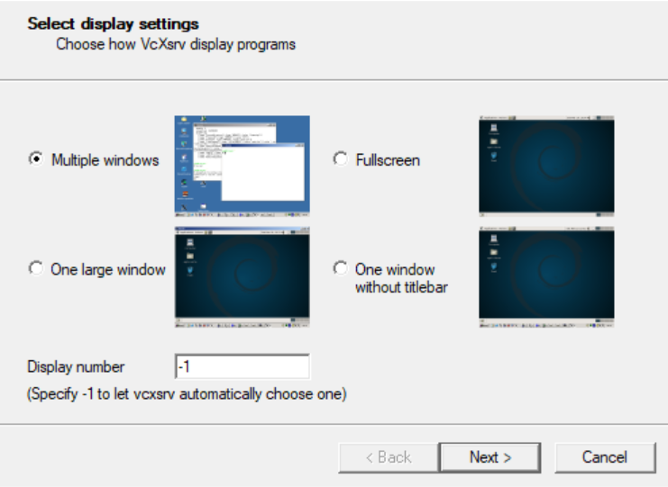
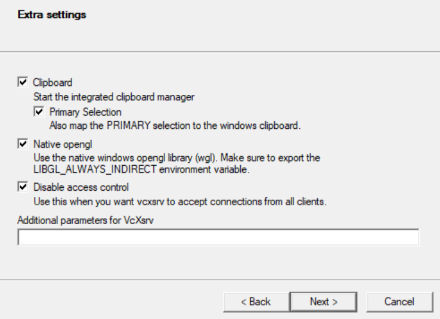

# Simultaneous Positioning, Observing, Tracking, Identifying Targets in 3D (SPOT-IT 3D)

## 1. Introduction

**SPOT-IT 3D** (Simultaneous Positioning, Observing, Tracking, Identifying Targets in 3D) is a project by Mechanical Engineering @ National University of Singapore. This project aims to develop a software that utilizes a multi-camera surveillance system for real-time multiple target tracking capabilities. This software capability is highly applicable for monitoring specific areas, and some use cases include monitoring airspaces, traffic junctions, etc.


## 2. Table of Contents

- [3. Publications](#3-publications)
- [4. Aim](#4-aim)
- [5. Capabilities](#5-capabilities)
- [6. Installation Guide](#6-installation-guide)
  * [6.1 Linux-based Operating Systems](#61-linux-based-operating-systems)
  * [6.2 Windows Operating Systems](#62-windows-operating-systems)
- [7. Acknowledgements](#9-acknowledgements)


## 3. Publications


1. Paper on trajectory-based target matching and re-identification between cameras:
	* Niven Sie Jun Liang and Sutthiphong Srigrarom. "Multi-camera multi-target tracking systems with trajectory-based target matching and re-identification." In *2021 IEEE International Conference on Unmanned Aerial Systems (ICUAS)*, IEEE, Athens, Greece, 2021.
	* Link to paper: (To be added into IEEE Xplore soon)

2. Paper on field test validations for using trajectory-based tracking with a multiple camera system for target tracking and 3-dimensional localization:
	* Niven Sie Jun Liang, Sutthiphong Srigrarom and Sunan Huang. "Field test validations of vision-based multi-camera multi-drone tracking and 3D localizing, using concurrent camera pose estimation." In *2021 IEEE 6th International Conference on Control and Robotics Engineering (ICCRE)*, IEEE, Beijing, China, 2021.
	* Link to paper: https://ieeexplore.ieee.org/abstract/document/9358454

3. Paper on state estimation filters and proposed use of implementing multiple state estimation filters in parrallel (Integrated Multiple Model):
	* Sutthiphong Srigrarom, Niven Sie Jun Liang, Jiahe Yi, Kim Hoe Chew, Floorian Holzapfel, Henrik Hesse, Teng Hooi Chan and Jalvin Jiaxiang Chen. "Vision-based drones tracking using correlation filters and Linear Integrated Multiple Model." In *2021 IEEE International Conference on Electrical Engineering/Electronics, Computer, Telecommunications and Information Technology (ECTI-CON)*, IEEE, Chiang Mai, Thailand, 2021.
	* Link to paper: (To be added into IEEE Xplore soon)

4. Paper on integrated kinematic-based detection tracking estimation system for dynamic localization of small aerial vehicles:
	* Sutthiphong Srigrarom, Shawndy Michael Lee, Mengda Lee, Foong Shaohui and Photchara Ratsamee. "An integrated vision-based detection-tracking-estimation system for dynamic localization of small aerial vehicles." In *2020 IEEE 5th International Conference on Control and Robotics Engineering (ICCRE)*, IEEE, Osaka, Japan, 2020.
	* Link to paper: https://ieeexplore.ieee.org/abstract/document/9096259

5. Paper on binocular and stereo cameras for multiple drone detection and 3-dimensional localization:
	* Yi, Jiahe, and Sutthiphong Srigrarom. "Near-Parallel Binocular-Like Camera Pair for Multi-Drone Detection and 3D Localization." In *2020 16th International Conference on Control, Automation, Robotics and Vision (ICARCV)*, pp. 204-210. IEEE, Shenzhen, China, 2020.
	* Link to paper: https://ieeexplore.ieee.org/abstract/document/9305485


## 4. Aim

This project aims to develop a methodology of identification, localization, and tracking of **small and fast moving targets**, such as flying drones, using an integrated multiple camera monitoring system. Our study focuses on using **motion-based** features to track targets, instead of traditional tracking algorithms that use appearance-based features by incorporating deep convolutional neural networks for target tracking. 

As we focus on small and fast moving targets, such as drones, using appearance-based features in this specific case may be difficult, as these targets often appear as small black "dots/blobs" in video frames. This would specifically mean that we use targets’ **trajectory features**, such as the derivatives of displacement, heading and turning angle, to identify and track targets instead.

Thus, our software incorporates the use of a multiple camera surveillance system to track and localize these moving targets. We aim to be able to continuously track drones in monitored airspaces, re-identify these targets between the cameras, and montor their 3-dimensional coordinates when they are inside the monitored space. 


## 5. Capabilities

SPOT-IT 3D can be thought of as being broadly comprising two main processes. They are the **detection and tracking process**, and the **re-identification and trackplot process**. The software is built entirely in C++ for high runtime performance capabilities.

The following is a general high-level overview of the main code pipeline:

1. Open and read from single / double camera sensors, and obtain live camera frames.

2. Compensate for environmental effects (e.g. bright sunlight, dark skies) that may affect detection of targets. This works by converting each frame to HSV and applying localised image enhancements to the S and V channels of the sky.

3. Apply background subtraction using OpenCV's MOG2 to remove noise in the background.

4. Apply either blob or contour detection to detect targets in the frame. Morphological operations such as erosion and dilation are used to remove noise and enhance detection.

5. Use of Kalman filtering (KF) and Discriminative Correlation Filter (DCF) as our state estimation techniques to predict our targets' next known location in the following frames. Both filters are implemented in our tracking pipeline, as these targets move at fast and erratic speeds, and using these filters allow us to better predict their positions for continuous tracking.

6. Implements the use of Hungarian / Munkre's algorithm to match our detections to tracks. The matching algorithm is based on a 2 dimensional cost matrix of tracks and detections, where the cost is computed by comparing every detection's euclidean distance away from each tracked target predicted location from our DCF and EKF filters. 

7. The software has re-identification capabilities of targets between cameras. This would mean that every camera will be able to know that they are tracking the same target, purely based on their kinematic features. We implement cross-correlation matching of tracks' trajectory features, and obtain a 2-dimensional correlation score between the cameras' tracks.

8. Apply graph matching algorithm for geomentry-based identification using relative coordinates. The software initializes a complete bipartite graph, that calculates the maximum sum of the weights of the edges that span across the two disjoint groups of the complete bipartite graph. Three distinct methods are used to calculate a similarity score and serve as graph edge weights in our re-identification process.

9. Estimation of targets' location in 3-dimensional space using triangulation and stereo camera methodology. We use disparities between the two camera frames to obtain depth estimations of the tracked targets.

## 6. Installation Guide

The following step-by-step processing will guide you on the installation process. Our software runs on a Linux environment, is heavily dependent on OpenCV 4.5.2 and above, and compiles using CMake.

### 6.1 Linux-based Operating Systems

1. Install Open CV and other dependencies

	Make sure your sources are updated

	``` bash
	sudo apt-get update
	sudo apt-get upgrade
	```

	Install dependencies

	``` bash
	sudo apt-get install build-essential cmake git libgtk2.0-dev pkg-config libavcodec-dev libavformat-dev libswscale-dev
	sudo apt-get install python3.5-dev python3-numpy libtbb2 libtbb-dev
	sudo apt-get install libjpeg-dev libpng-dev libtiff5-dev libjasper-dev libdc1394-22-dev libeigen3-dev libtheora-dev libvorbis-dev libxvidcore-dev libx264-dev sphinx-common libtbb-dev yasm libfaac-dev libopencore-amrnb-dev libopencore-amrwb-dev libopenexr-dev libgstreamer-plugins-base1.0-dev libavutil-dev libavfilter-dev libavresample-dev
	```
	
	Navigate to any folder of your choice and install Open CV (instructions have been modified from the OpenCV Installation Docs: https://docs.opencv.org/4.5.2/d7/d9f/tutorial_linux_install.html):

	``` bash
	# Clone sources
	git clone https://github.com/opencv/opencv.git
	git clone https://github.com/opencv/opencv_contrib.git

	# Create build directory and switch into it
	mkdir opencv_build
	cd opencv_build

	# Configure; note that several flags are toggled for optimisation purposes
	cmake -D BUILD_TIFF=ON -D WITH_CUDA=OFF -D ENABLE_AVX=OFF -D WITH_OPENGL=OFF -D WITH_OPENCL=OFF -D WITH_IPP=OFF -D WITH_TBB=ON -D BUILD_TBB=ON -D WITH_EIGEN=OFF -D WITH_V4L=ON -D WITH_VTK=OFF -D BUILD_TESTS=OFF -D BUILD_PERF_TESTS=OFF -D CMAKE_BUILD_TYPE=RELEASE -D OPENCV_GENERATE_PKGCONFIG=YES -D CMAKE_INSTALL_PREFIX=/usr/local -D OPENCV_EXTRA_MODULES_PATH=../opencv_contrib/modules ../opencv

	# Build
	make -j4
	sudo make install
	sudo ldconfig
	```

	You can test whether OpenCV is successfully installed using the following command:

	``` bash
	pkg-config --modversion opencv4
	```

2. Pull spot-it-3d repository from GitHub.

	``` bash
	get clone https://github.com/seahhorse/spot-it-3d.git
	```

3. Navigate to the spot-it-3d parameters file and open it with a text editor of choice.

	``` bash
	nano spot-it-3d/include/multi_cam_params.hpp
	```

4. 	Replace the parameters as shown below to your specific setup.

	``` cpptools
	// declare session and camera parameters
    // follow convention: "YYYY-DD-MM_<location>_<session no>"
    // for non-realtime processing (IS_REALTIME_ = 0), input files should be named in the format "<SESSION_NAME_>_<CAMERA_INPUT_>.<INPUT_FILE_EXTENSION_>". Example: "A_0.avi"
	// for realtime processing with direct USB cameras, specify the device number directly in CAMERA_INPUT_. SESSION_NAME_ will only be used for writing output files
    // for vilota edge cameras (IS_REALTIME_ = 2), specify IP addresses directly in CAMERA_INPUT_. SESSION_NAME_ will only be used for writing output files
	const int IS_REALTIME_ = // 0 = non realtime processing, 1 = realtime processing with direct USB cameras, 2 = realtime processing for vilota edge cameras ;
    const int NUM_OF_CAMERAS_ = // 1 for single camera processing, 2 for double camera processing;
    const std::string SESSION_NAME_ = "A" // example
    const std::vector<std::string> CAMERA_INPUT_ = {"0", "1"}; // example
    const std::string INPUT_FILE_EXTENSION_ = "avi"; // example

	// declare video parameters
	const int FRAME_WIDTH_ = 1920;
    const int FRAME_HEIGHT_ = 1080;
	```

	Take special note that each camera is pre-built with a set of (resolution, fps) settings. To check all possible combinations, run:

	```bash
	v4l2-ctl -d /dev/video# --list-formats-ext
	```
	with # replaced with your camera device number.


5. Run the CMake compile script. You will be prompted to install OpenCV 4 if the system does not have the required version.

	``` bash
	bash compile_cmake.sh
	```

6. The compile scripts generate an executable named "spot-it-3d" in the root folder of this repository. Run the executable to run the program:

	``` bash
	./spot-it-3d
	```

### 6.2 Windows Operating Systems

1. Navigate to the Windows Store and install WSL2 (Windows Subsystem for Linux 2). Detailed instructions can be found at https://docs.microsoft.com/en-us/windows/wsl/install-win10.

2. Download and install XMing X Server for Windows. Detailed instructions can be found at http://www.straightrunning.com/XmingNotes/.

3. Launch XLaunch and select the following settings:

	

	

	

	*For ease of starting up in subsequent runs, you may wish to save these settings by clicking on the Save Configuration button.*

	If the client was launched successfully, you should see a mini-icon in the sidebar at the bottom right-hand corner of your screen.

4. Open up a WSL2 terminal and follow the instructions in **6.1 Linux-based Operating Systems**.

## 7. Acknowledgements

We would like to thank the lead researcher in this project, Dr. Sutthiphong Srigrarom, for his continuous guidance and supervision with the development of this project. We would also like to acknowledge the hard work the team in playing a part in developing this software. Our research team comprises:

1. Dr. Sutthiphong Srigrarom (email: spot.srigrarom@nus.edu.sg, GitHub profile: https://github.com/spotkrub)
2. Niven Sie Jun Liang (email: sieniven@gmail.com, GitHub profile: https://github.com/sieniven)
3. Seah Shao Xuan (email: shaoxuan.seah@gmail.com, GitHub profile: https://github.com/seahhorse)
4. Lau Yan Han (email: sps08.lauyanhan@gmail.com, GitHub profile: https://github.com/disgruntled-patzer)
5. Kieren Chua (email: kieren.chua23@gmail.com), Github profile: https://github.com/YeOldMan23